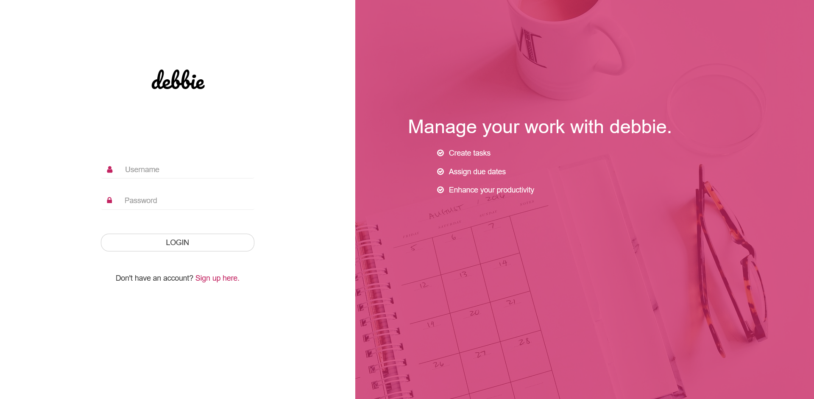

# Debbie

## Usage

### Installation
Install bower

    $ npm install -g bower

Install bootstrap using bower

    $ bower install bootstrap

Install the project dependencies

    $ npm install

Run the project

    $ npm start

or if you have `nodemon` installed, run

    $ nodemon
